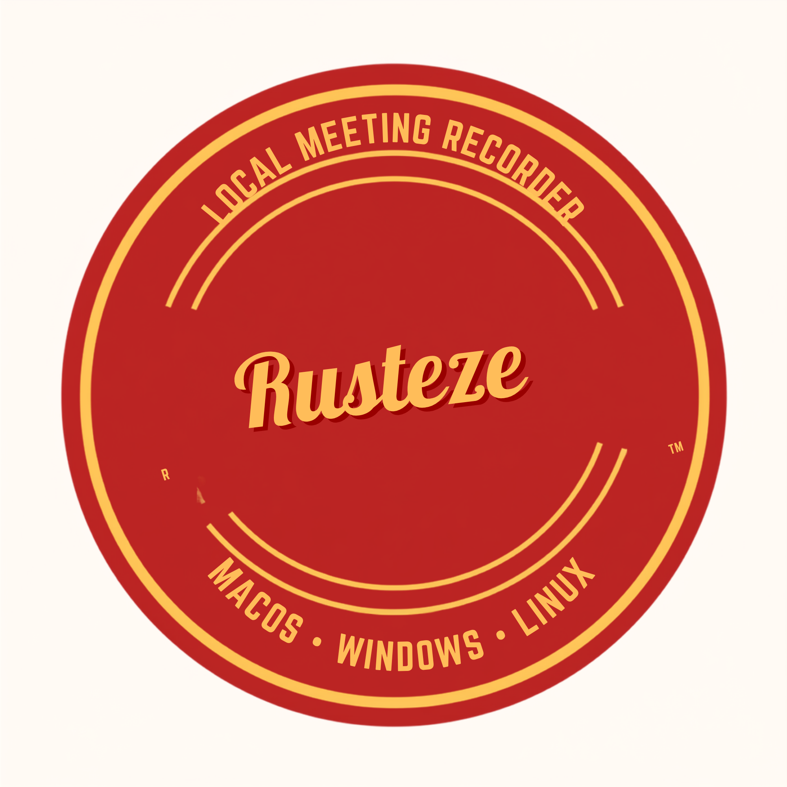

<div align="center">
  

  <h1>Rusteze</h1>

  <p><strong>Local-first audio capture for meetings and system audio.</strong></p>
  <p>Capture the room. Keep the files. Stay in control.</p>

  <p>
    <a href="https://github.com/sanjayy0612/rusteze"></a>
    <a href="https://www.rust-lang.org/"></a>
    <a href="https://github.com/sanjayy0612/rusteze"></a>
    <a href="https://github.com/sanjayy0612/rusteze"></a>
  </p>
</div>

Rusteze is a local-first CLI for macOS, Windows, and Linux. It captures meeting and system audio through each platform's supported native APIs, saves it locally, and can optionally generate transcripts and summaries. It helps people preserve useful meetings and create notes without depending on a hosted recorder's free tier.

Rusteze is a terminal-first, open-source tool. It is deliberately not distributed through Homebrew or Winget; people who want to use it can clone the repository and build it for their platform.

It captures system audio, microphone audio, or both, preserves the source tracks, creates a post-recording mix when both sources are enabled, and provides a replaceable boundary for local transcription.

> Rusteze is in active development. macOS and Windows recording paths are working; the Linux PipeWire path still needs end-to-end validation on real hardware.

Always tell participants that a recording is being made, obtain the required consent, and follow the laws and policies that apply to your meeting.

## At a glance

<table>
  <tr>
    <td width="50%"><strong>🎙 Native capture</strong><br>Swift audio frameworks on macOS, WASAPI on Windows, and PipeWire on Linux.</td>
    <td width="50%"><strong>🔒 Local by default</strong><br>Audio, metadata, and future transcripts stay on your computer.</td>
  </tr>
  <tr>
    <td><strong>🎚 Separate tracks</strong><br>Keep system audio and microphone audio independent for better control.</td>
    <td><strong>🏁 Safe sessions</strong><br>Graceful <code>Ctrl+C</code> shutdown, lifecycle metadata, recovery, and disk checks.</td>
  </tr>
</table>

## What it does

- Captures meeting playback and, when enabled, microphone input through supported native OS audio APIs.
- Captures audio directly on macOS, Windows, and Linux.
- Supports system audio only, system audio plus microphone, or microphone only.
- Preserves independent source tracks and derives a mixed track after two-source recordings stop.
- Stores each meeting in its own folder with lifecycle metadata in `session.json`.
- Keeps the transcription engine replaceable instead of locking the project to one model.

Once a local transcript exists, Rusteze can support an optional summary workflow. The choice of summary engine or provider remains separate from audio capture, so a pricing or free-tier change does not break recording or hold your notes hostage to one service.

## Platform backends

| Platform | Capture implementation | System track | Microphone track | Derived mix | Status |
| --- | --- | --- | --- | --- | --- |
| macOS | Swift helper using Apple audio frameworks | `system.caf` | `mic.caf` | `mixed.caf` | Working |
| Windows | Native Rust WASAPI | `system.wav` | `mic.wav` | `mixed.wav` | Working |
| Linux | Native Rust PipeWire | `system.wav` | `mic.wav` | `mixed.wav` | Needs real-hardware validation |

The Windows backend uses the default render endpoint in loopback mode for system audio and the default capture endpoint for the microphone. The Linux backend uses PipeWire’s active output monitor and default input source. No device names are hardcoded.

## Quick start

### Prerequisites

Install Rust through [rustup](https://rustup.rs/), then clone the repository:

```bash
git clone https://github.com/sanjayy0612/rusteze.git
cd rusteze
```

Build and run the CLI:

```bash
cargo build
cargo run -- start "Project sync"
```

Press `Ctrl+C` to finish the recording safely.

### Recording modes

```bash
# System audio only (default)
cargo run -- start "Project sync"

# System audio and microphone
cargo run -- start "Project sync" --mic

# Microphone only
cargo run -- start "Project sync" --mic-only
```

The title is optional. If omitted, Rusteze uses `untitled`.

### Permissions

Request only the permissions required by a mode:

```bash
cargo run -- request-permissions
cargo run -- request-permissions --mic
cargo run -- request-permissions --mic-only
```

On macOS, enable the terminal or Rusteze binary under **System Settings → Privacy & Security → Microphone** and **Screen & System Audio Recording**. The macOS helper asks for the permissions required by the selected mode.

Windows permissions and endpoint availability are managed by Windows and the active audio session. Linux has no Rusteze permission prompt; PipeWire and the desktop session determine whether the default nodes are available.

## macOS setup

The macOS capture boundary is a small Swift helper built with Xcode’s Swift compiler:

```bash
./macos-helper/build.sh
cargo run -- start "macOS test"
```

The helper can also request permissions directly:

```bash
./macos-helper/.build/debug/rusteze-capture-helper request-permissions system
```

To use a helper binary at another path during development:

```bash
RUSTEZE_CAPTURE_HELPER=/path/to/rusteze-capture-helper \
  cargo run -- start "Custom helper test"
```

## Windows setup

Build on Windows with a Windows Rust toolchain:

```powershell
cargo build
cargo build --release
cargo run -- start "Windows test"
```

Rusteze uses COM to initialize the native Windows audio APIs and WASAPI to read the default render endpoint in loopback mode and the default microphone endpoint. No external recorder is required.

## Linux setup

Rusteze uses the native [`pipewire`](https://crates.io/crates/pipewire) Rust bindings. Install the development headers before building.

### Debian or Ubuntu

```bash
sudo apt update
sudo apt install build-essential pkg-config clang libclang-dev \
  libpipewire-0.3-dev libspa-0.2-dev
```

### Fedora

```bash
sudo dnf install gcc gcc-c++ make pkgconf-pkg-config clang pipewire-devel
```

### Arch Linux

```bash
sudo pacman -S --needed base-devel pkgconf clang pipewire libpipewire
```

Then build and run with an active PipeWire desktop session:

```bash
cargo build
cargo test
cargo run -- start "Linux test"
```

PipeWire negotiates the graph’s sample rate and channel count. Rusteze converts the negotiated floating-point frames to PCM16 WAV. The current Linux backend intentionally uses the default/active nodes; explicit device selection, portal integration, PulseAudio fallback, and seamless device-change recovery are future work.

## Where recordings go

Each recording is stored under:

```text
~/Documents/rusteze/meetings/
└── <timestamp>-<meeting-title>/
    ├── session.json
    ├── system.caf       # macOS, when system audio is enabled
    ├── mic.caf          # macOS, when microphone is enabled
    ├── system.wav       # Windows/Linux, when system audio is enabled
    ├── mic.wav          # Windows/Linux, when microphone is enabled
    ├── mixed.caf        # macOS, derived after a two-source recording
    ├── mixed.wav        # Windows/Linux, derived after a two-source recording
    ├── transcript.md    # written when a transcription engine is available
    └── transcript.json   # written when a transcription engine is available
```

Rusteze checks for at least 256 MiB of free space before recording. A session moves through `recording`, `stopping`, and `completed`. For `--mic` recordings, mixing runs only after both source files are finalized. The mixer resamples and channel-maps the inputs, applies half gain to each, and publishes the derived file atomically without modifying either source. If capture, mixing, or finalization fails, it records a `failed` state and a recoverable reason in `session.json`.

You can retry mixing for any session that contains both source tracks:

```bash
cargo run -- mix ~/Documents/rusteze/meetings/<session-folder>
```

## Transcription status

The CLI already exposes the transcription boundary:

```bash
cargo run -- transcribe ~/Documents/rusteze/meetings/<session-folder>
```

The bundled engine is intentionally unconfigured. The project defines the portable transcript types and output files, but a local engine such as whisper.cpp still needs to be selected and connected.

Before uploading or transcribing a macOS CAF recording, prepare a broadly compatible speech WAV:

    cargo run -- prepare-audio ~/Documents/rusteze/meetings/<session-folder>/system.caf

This creates system-16k-mono.wav beside the CAF. It is mono, 16 kHz, 16-bit PCM and is suitable for common speech transcription tools and audio upload workflows. Pass a second path to choose the output location.

## CLI reference

```text
rusteze start [title] [--mic|--mic-only]
rusteze request-permissions [--mic|--mic-only]
rusteze create-meeting [title]
rusteze mix <session-path>
rusteze transcribe <session-path>
```

## Architecture

```text
Rust CLI
  ├─ creates the meeting folder and session.json
  ├─ selects the capture mode
  ├─ starts and supervises the platform backend
  ├─ handles Ctrl+C
  ├─ derives a mixed track after two-source capture
  └─ finalizes session state

macOS: Swift helper → Apple audio frameworks → CAF tracks
Windows: Rust → WASAPI → WAV tracks
Linux: Rust → PipeWire → WAV tracks

Finalized source tracks → post-recording mixer → mixed.caf / mixed.wav
Completed session → TranscriptionEngine → transcript.md + transcript.json
```

The platform backends remain behind the native capture boundary. Shared Rust code owns session policy, metadata, shutdown, disk checks, and portable output behavior.

## Development checks

Run the platform-independent checks on every change:

```bash
cargo fmt -- --check
cargo test
git diff --check
```

macOS build check:

```bash
cargo build
./macos-helper/build.sh
```

Windows build check:

```powershell
cargo build
```

Linux build check:

```bash
cargo build
cargo test
```

## Project boundaries

Rusteze does not currently provide:

- cloud recording or cloud transcription;
- automatic meeting bots;
- LLM summaries or publishing integrations;
- per-application audio capture;
- explicit Linux device selection;
- a production transcription model;
- background daemon or system-service support.

These boundaries keep the project local-first, testable, and small enough to understand while the native capture paths mature.
